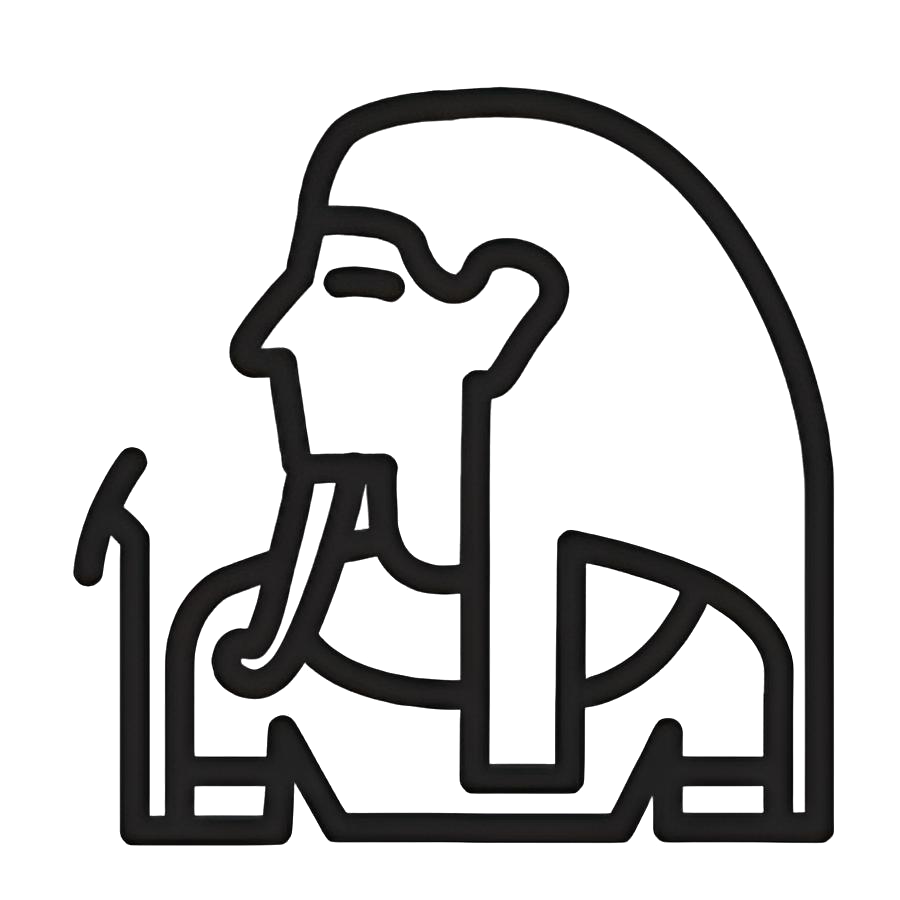
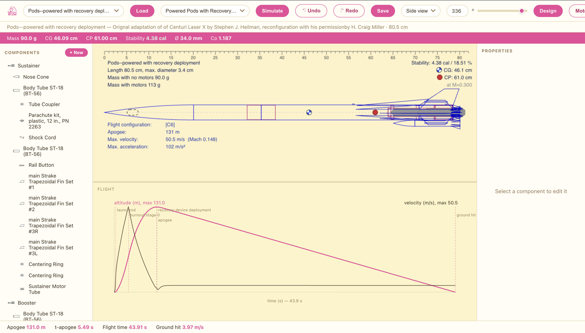
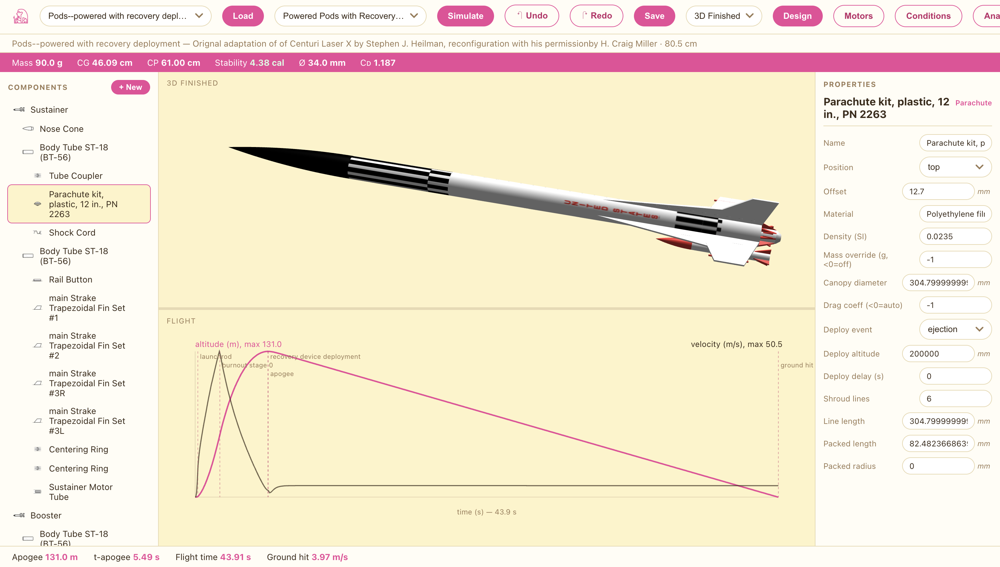

<div align="center">



# OpsRocket

**A Rust rewrite of the [OpenRocket](https://openrocket.info/) model-rocket simulator core — verified against measured altimeter data, not just the reference implementation.**

[](https://www.gnu.org/licenses/gpl-3.0)
[](https://www.rust-lang.org/)
[](#running-the-tests)
[](https://ops.sg)

[Live demo](https://ops.sg) · [Numerical fidelity](#-numerical-fidelity) · [Real-world validation](#-real-world-validation) · [Quick start](#-quick-start) · [Docs](docs/)

</div>

---

OpsRocket reproduces the **headless simulation pipeline** of OpenRocket — `.ork`
file loading, Barrowman aerodynamic coefficients, mass properties, motor
thrust curves, and 6-DOF flight propagation — in safe, dependency-light Rust,
with numerical output that tracks the upstream Java engine to within a few
percent and tracks a *real flown rocket* to within measurement error.

It is a clean-room third-party reimplementation. It is **not affiliated with
OpenRocket** and is licensed GPL-3.0-or-later to match the upstream project
and its `.ork` / flight-data conventions.

## 🛠️ Design · Visualize · Analyze

An OpenRocket `.ork` design — loaded, edited, simulated, and rendered
**entirely in the browser** at **[ops.sg](https://ops.sg)**, no install,
the full Rust engine compiled to WebAssembly.

**Design & analyze** in the 2D blueprint view — live mass / CG / CP /
stability calibers, component tree, per-component property editor, and the
full altitude/velocity flight plot with launch-rod / burnout / apogee /
recovery / ground-hit event markers:



**Visualize** the finished rocket in textured 3D, simulation plot below:



## 🌟 Features

- **Six-degree-of-freedom flight simulation** — quaternion attitude,
  body-frame angular velocity, adaptive RK4 integrator ported from Java's
  `RK4SimulationStepper` (angle / rotation / event-time step limiting).
- **Full Barrowman aerodynamics** — slender-body `CN_α` / `CP`, Mach-aware
  subsonic fin `CN_α` with Prandtl–Glauert β, Pitts–Nielsen–Kaattari
  fin–body interference, Galejs AOA-coupled body lift, Java pitch-damping.
- **Drag model parity** — fully-turbulent Schlichting friction with Mach
  and roughness correction, Hoerner base drag, FinSetCalc pressure drag,
  TubeCalc launch-lug internal-flow drag, NASA TR-R-100 subsonic nose drag.
- **Real motor curves** — `.eng` / `.rse` loader plus 50+ Estes / AeroTech /
  Quest / Klima curves exported from upstream `initial_motors.db`.
- **`.ork` read + round-trip write** — ZIP+XML, 17/17 upstream fixtures.
- **Multi-stage & clustered motors** — per-stage motors, separation events,
  airstart timing, parallel boosters.
- **Java `ExtendedISAModel` atmosphere** — 8 layers, 500 m cache,
  geopotential conversion, ported verbatim.
- **Instant-deploy recovery** — parachute model matching
  `BasicLandingStepper.computeCD`.
- **Built-in regression diff** — `opsrocket diff` extracts the cached
  `<datapoint>` reference embedded in every `.ork` and reports
  max / mean / RMS / max-relative error per flight-data column.
- **Browser & desktop frontends** — WASM workbench (runs entirely
  client-side) and a Tauri + Three.js desktop GUI, both on the same core.

## 📊 Numerical fidelity

Canonical *"A simple model rocket"* fixture, OpsRocket vs the Java-cached
reference flight data embedded in the same `.ork`:

| Metric | Java reference | OpsRocket | Δ |
|---|---|---|---|
| Empty mass | 49.0 g | **49.05 g** | **+0.1 %** |
| Apogee | 50.59 m | **49.12 m** | **−2.9 %** |
| Time to apogee | 3.48 s | **3.40 s** | −2.3 % |
| Flight time | 15.9 s | **15.50 s** | −2.5 % |
| Ground-hit velocity | 4.68 m/s | **4.65 m/s** | **−0.7 %** |
| Boost drag coefficient | 0.617 | **0.6255** | +1.4 % |
| CP location | 0.31 m | **0.319 m** | +3 % |

The residual ~3 % is dominated by `StrictMath`-vs-libm last-bit divergence
accumulated over ~16 s of integration and a small known transonic-drag gap —
**not** a modelling error. See [`docs/STATUS.md`](docs/STATUS.md) and
[`docs/PRECISION_GAP.md`](docs/PRECISION_GAP.md) for the full breakdown.

## 🎯 Real-world validation

The question that actually matters isn't "how close is OpsRocket to Java" —
it's "how close is OpsRocket to a rocket that was *built, flown, and measured
with an altimeter*." Using the flight data in the *OpenRocket Technical
Documentation* (Niskanen 2013, Ch. 6), calibrated on the single trusted
C6-3 anchor:

| Case | OpsRocket | Measured (altimeter) | vs reality |
|---|---|---|---|
| **C6-3 (trusted curve)** | **151.5 m** | 151.5 m | **−0.0 %** |
| Java OpenRocket C6-3 | 161.4 m | 151.5 m | +6.5 % |
| RockSim 8 C6-3 | 180.1 m | 151.5 m | +18.9 % |

OpsRocket's −3 % offset *relative to Java* lands it **nearer the truth, not
further from it** — forcing bit-for-bit Java parity would inject Java's own
+6.5 % real-world bias. Full caveats and reproduction in
[`docs/VALIDATION.md`](docs/VALIDATION.md):

```
cargo run -p opsrocket-cli --example thesis_validation
```

## 🚀 Quick start

```bash
# Simulate the default flight configuration and write a CSV
cargo run -p opsrocket-cli -- simulate "tests/fixtures/examples/A simple model rocket.ork" --csv out.csv

# Inspect the rocket structure
cargo run -p opsrocket-cli -- inspect "tests/fixtures/examples/A simple model rocket.ork"

# Diff against the Java-cached reference, worst columns first
cargo run -p opsrocket-cli -- diff "tests/fixtures/examples/A simple model rocket.ork"
```

`opsrocket --help` lists every subcommand (`simulate`, `inspect`,
`dump-reference`, `diff`).

### Running the tests

```bash
cargo test --workspace          # 45 passing — core, io, sim, regression harness
```

The Tauri GUI crate is intentionally excluded from the workspace so the test
suite stays fast and free of the desktop dependency tree.

### Web workbench

A zero-install build runs the full engine in the browser via WebAssembly —
open a `.ork`, see the 2D/3D rocket, simulate, plot:

**→ [ops.sg](https://ops.sg)**

```bash
cd web && npm install && npm run dev     # local Next.js showcase + workbench
```

### Desktop GUI

```bash
cd gui && npm install && npm run tauri dev
```

Tauri 2 + React + Vite + Three.js; the simulation core runs **in-process**
in the Rust backend, so opening and simulating a `.ork` are direct calls.

## 🗂️ Workspace layout

```
crates/
  opsrocket-core/    geometry, units, component model, atmosphere
  opsrocket-io/      .ork (zip+XML) reader/writer, motor (.rse/.eng) loader
  opsrocket-sim/     mass, Barrowman aero, adaptive RK4, event engine
  opsrocket-cli/     `opsrocket simulate|inspect|diff …`
  opsrocket-tests/   regression harness vs embedded reference outputs
  opsrocket-view/    shared 2D profile / render model (CLI + web + GUI)
  opsrocket-wasm/    wasm-bindgen surface for the browser workbench
  opsrocket-web/     axum HTTP server (headless web mode)
gui/                 Tauri 2 + React + Three.js desktop frontend
web/                 Next.js showcase site + client-side WASM workbench
docs/                STATUS · VALIDATION · PRECISION_GAP · PORTING_NOTES
tests/fixtures/      17 upstream .ork files + .eng motor curves
```

## 📖 Documentation

| Doc | What's in it |
|---|---|
| [`docs/STATUS.md`](docs/STATUS.md) | Per-metric / per-column fidelity, subsystem checklist |
| [`docs/VALIDATION.md`](docs/VALIDATION.md) | Validation against measured altimeter flight data |
| [`docs/PRECISION_GAP.md`](docs/PRECISION_GAP.md) | What blocks sub-1e-4 parity and what each costs |
| [`docs/PORTING_NOTES.md`](docs/PORTING_NOTES.md) | Non-obvious Java→Rust mappings, file-format notes |

Every `.ork` from upstream OpenRocket embeds its own cached simulation
output as `<datapoint>` XML. `opsrocket-tests` extracts these and compares
them against OpsRocket simulating the same file — so regressions are caught
against the real reference engine, not hand-written expectations.

## 🙏 Acknowledgements

Algorithms, file format, atmosphere model, and numerical conventions are
ported from [OpenRocket](https://github.com/openrocket/openrocket) by Sampo
Niskanen and the OpenRocket contributors, and validated against the
*OpenRocket Technical Documentation* (Niskanen, 2013). This project is an
independent reimplementation and is **not affiliated with or endorsed by**
the OpenRocket project. See [`docs/PORTING_NOTES.md`](docs/PORTING_NOTES.md)
for upstream references.

## 📜 License

GPL-3.0-or-later, matching upstream OpenRocket. See [`LICENSE.TXT`](LICENSE.TXT).
</content>
